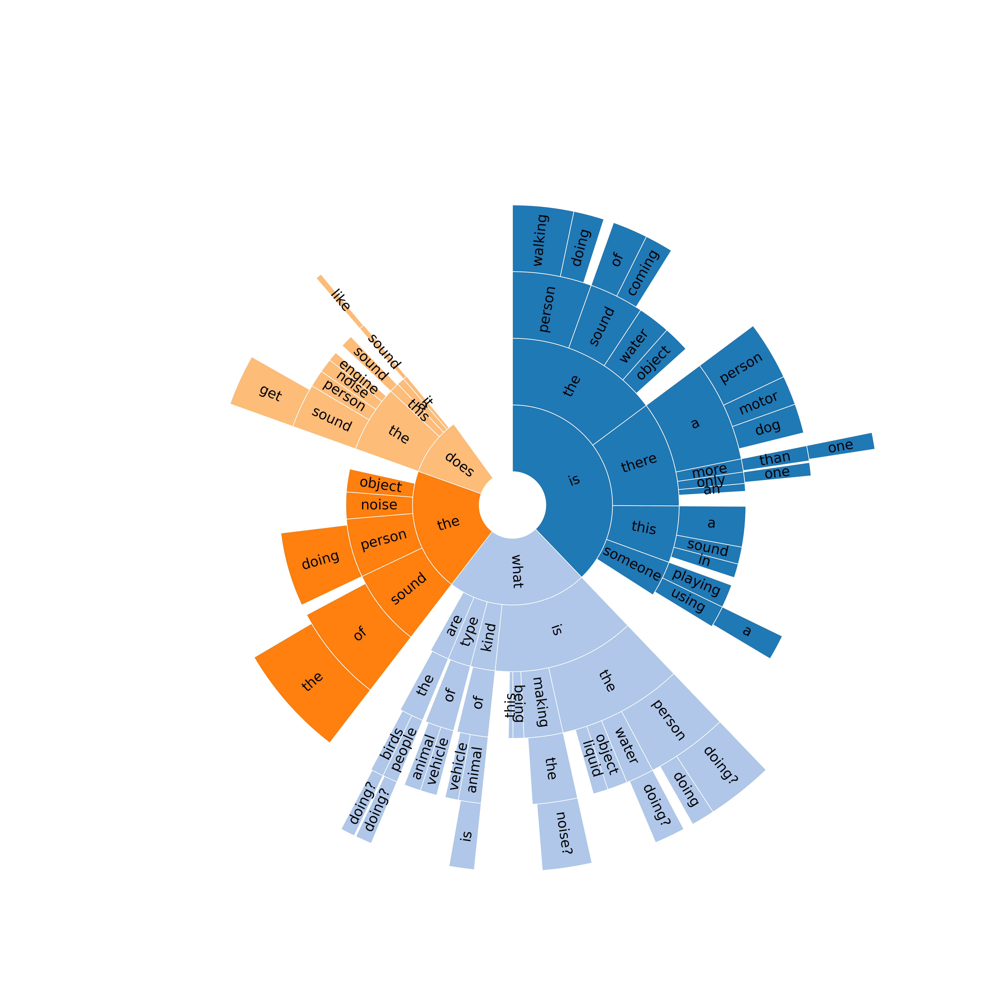

# sunburst

A simple Python implementation of ngram sunburst (nested pie chart) visualization.
Here are some basic arguments to run the Analysis.py:
~~~python
parser.add_argument('-read', help='read from', default="example.txt")
parser.add_argument('-ngram', help='ngram', type=int, default=3)
parser.add_argument('-max_display_num', help='max number of ngrams to display', 
                    type=int, default=3)
parser.add_argument('-min_count', help='min word occurence below which the word will not be displayed', 
                    type=int, default=1)
parser.add_argument('-adjust_value', help='adjust node value for better visulization', 
                    type=int, default=1)
parser.add_argument('-adjust_ratio', help='the total ratio taken up by child nodes', 
                    type=float, default=0.65)
~~~

Simple run in a console
~~~python
python Analysis.py -read=example.txt
~~~

The ngrams are stored through Trie structure, which is later pruned based on max_display_num and min_count arguments.

The arguments are rather simple despite maybe the last two:
adjust_value is a boolean value (1 or 0) indicating whether or not to adjust the ngram value for better visualization. It's recommanded when visualizing ngrams from a large corpus, for the distribution are always too sparse to visualize. When adjust_value=1, all sub-words of an ngram will be adjusted to take up adjust_ratio of radian of the father-word.

See the below figure.

